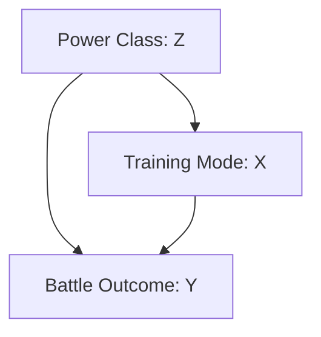

# Demystifying Judea Pearl's $do$-calculus "By Hand": Resolving the Superhero Training Paradox

* **Author:** Ayushman Saini
* **Project Type:** Foundational Causal Inference & Structural Causal Modeling (SCM)
* **Objective:** To demonstrate the difference between statistical association $P(Y\mid X)$ and causal intervention $P(Y\mid do(X))$ using a hand-calculated 3-node graph with a hidden confounder and the Backdoor Adjustment Formula.

---

## 1. Executive Summary & Core Philosophy

Most modern AI systems learn from passive observation. They discover statistical associations in data, but they do not by themselves distinguish whether $X$ causes $Y$ or whether both are driven by a shared hidden factor.

This project constructs a compact structural universe with a hidden confounder and verifies Pearl's **Backdoor Adjustment Formula** entirely by hand. The result is a polished, academic-style causal analysis that demonstrates how observational probabilities can be misleading, while the interventional distribution recovers the true causal effect.

---

## 2. The Superhero Narrative & Experimental Setup

We study a simple causal universe defined by three binary variables:

* **$X$ (Treatment / Exposure):** Training Mode
  * $X = 1$: High-Tech Exo-Suit
  * $X = 0$: Organic training
* **$Y$ (Outcome / Effect):** Battle Result
  * $Y = 1$: Victory
  * $Y = 0$: Defeat
* **$Z$ (Confounder):** Innate Power Class
  * $Z = 1$: Metahuman / God-like power
  * $Z = 0$: Street-level / non-powered human

### Problem Mechanism

Metahumans rarely use suits and still win most battles. Street-level heroes use suits more often, but they have lower base win rates. This creates a classic selection bias: the treatment $X$ is correlated with the confounder $Z$, and $Z$ also influences the outcome $Y$.

---

## 3. Data Definition and Joint Distribution

The dataset contains 20 hero battle records. Each row is a historical observation of $Z$, $X$, and $Y$.

| Hero ID | Power Class ($Z$) | Training Mode ($X$) | Battle Outcome ($Y$) | Narrative Context |
| --- | --- | --- | --- | --- |
| 1 | 1 | 0 | 1 | Kryptonian / Flight |
| 2 | 1 | 0 | 1 | Amazonian Demi-God |
| 3 | 1 | 0 | 1 | Atlantean Royalty |
| 4 | 1 | 0 | 1 | Cosmic Sorcerer |
| 5 | 1 | 0 | 1 | Speedster |
| 6 | 1 | 0 | 1 | Alien Mutant |
| 7 | 1 | 1 | 1 | Thunder God / Armor trial |
| 8 | 1 | 1 | 1 | Energy Manipulator |
| 9 | 0 | 0 | 1 | Martial Arts Master |
| 10 | 0 | 0 | 0 | Vigilante Archer |
| 11 | 0 | 0 | 0 | High-Tech Detective |
| 12 | 0 | 0 | 0 | Acrobat Brawler |
| 13 | 0 | 1 | 1 | Armored Billionaire |
| 14 | 0 | 1 | 1 | Cybernetic Spy |
| 15 | 0 | 1 | 1 | Ex-Military Pilot |
| 16 | 0 | 1 | 1 | Street Thief |
| 17 | 0 | 1 | 0 | Bounty Hunter |
| 18 | 0 | 1 | 0 | Ninja Assassin |
| 19 | 0 | 1 | 0 | Boxer Vigilante |
| 20 | 0 | 1 | 0 | Masked Detective |

The full CSV dataset is available in `data/hero_ledger.csv`.

---

## 4. Phase 1: Observational Association

When we ignore the hidden confounder $Z$, the dataset suggests the following associations:

### Observational counts

* Suited group ($X=1$): 10 heroes, 6 victories, 4 defeats
* Organic group ($X=0$): 10 heroes, 7 victories, 3 defeats

### Associational probabilities

$$P(Y=1 \mid X=1) = \frac{6}{10} = 0.60$$
$$P(Y=1 \mid X=0) = \frac{7}{10} = 0.70$$

### Naive conclusion

A purely observational model would conclude that suits reduce victory probability by 10 percentage points. This is a misleading conclusion because it ignores confounding.

---

## 5. Phase 2: Structural Causal Model and the Backdoor Criterion

The causal assumptions are encoded in a Directed Acyclic Graph (DAG):



### Path analysis

1. Causal path: $X \rightarrow Y$.
2. Backdoor path: $X \leftarrow Z \rightarrow Y$.

Because $Z$ affects both $X$ and $Y$, it is a confounder. The Backdoor Criterion says that if we condition on $Z$, we block the non-causal path and can compute the interventional effect.

### Empirical validation of the causal structure

* $P(X=1 \mid Z=1) = \frac{2}{8} = 0.25$ (Metahumans rarely use suits)
* $P(X=1 \mid Z=0) = \frac{8}{12} \approx 0.667$ (Street-level heroes rely on suits)
* $P(Y=1 \mid X=0, Z=1) = \frac{6}{6} = 1.00$ (Metahumans almost always win organically)
* $P(Y=1 \mid X=0, Z=0) = \frac{1}{4} = 0.25$ (Street-level heroes struggle organically)

Because $Z$ simultaneously biases treatment assignment and outcome, it satisfies the Backdoor Criterion and must be included in the adjustment.

---

## 6. Phase 3: Interventional Calculus and Backdoor Adjustment

We now replace the observation operator with Pearl's intervention operator $do(X)$.

The Backdoor Adjustment Formula is:

$$P(Y=1 \mid do(X=x)) = \sum_{z \in \{0,1\}} P(Y=1 \mid X=x, Z=z) \; P(Z=z)$$

This formula computes the expected outcome under an intervention that forces $X=x$ for the entire population.

---

## 7. Phase 4: Hand Calculation

### Subgroup success rates

1. $P(Y=1 \mid X=1, Z=1) = \frac{2}{2} = 1.00$
2. $P(Y=1 \mid X=1, Z=0) = \frac{4}{8} = 0.50$
3. $P(Y=1 \mid X=0, Z=1) = \frac{6}{6} = 1.00$
4. $P(Y=1 \mid X=0, Z=0) = \frac{1}{4} = 0.25$

### Base rates for the confounder

$$P(Z=1) = \frac{8}{20} = 0.40$$
$$P(Z=0) = \frac{12}{20} = 0.60$$

### Intervention: $do(X=1)$

$$P(Y=1 \mid do(X=1)) = 1.00 \cdot 0.40 + 0.50 \cdot 0.60$$
$$P(Y=1 \mid do(X=1)) = 0.40 + 0.30 = 0.70$$

### Intervention: $do(X=0)$

$$P(Y=1 \mid do(X=0)) = 1.00 \cdot 0.40 + 0.25 \cdot 0.60$$
$$P(Y=1 \mid do(X=0)) = 0.40 + 0.15 = 0.55$$

---

## 8. Final Causal Findings

* Observational association: $P(Y=1 \mid X=1) = 60\%$ and $P(Y=1 \mid X=0) = 70\%$.
* Interventional ground truth: $P(Y=1 \mid do(X=1)) = 70\%$ and $P(Y=1 \mid do(X=0)) = 55\%$.

### Strategic conclusion

The observational data presented an illusion: suits appeared harmful, but the causal analysis shows that forcing suit adoption increases victory probability by 15 percentage points. This is a textbook manifestation of Simpson's paradox caused by a hidden confounder.

### Summary comparison

| Analytical Framework | Notation | Value | Interpretation |
| --- | --- | --- | --- |
| Observational (Biased) | $P(Y=1 \mid X=1)$ | $60\%$ | Apparent suit performance |
| Observational (Biased) | $P(Y=1 \mid X=0)$ | $70\%$ | Apparent organic performance |
| Interventional (Causal) | $P(Y=1 \mid do(X=1))$ | $70\%$ | True effect of forcing suits |
| Interventional (Causal) | $P(Y=1 \mid do(X=0))$ | $55\%$ | True effect of organic training |

---

## 9. Verification Script

A clean Python verifier is included in `scripts/verifier.py`. It loads the same dataset, computes the observational fractions, and evaluates the backdoor adjustment.

```bash
python scripts/verifier.py
```

---

## 10. Advanced Conceptual Note: The Descendant & Mediator Trap

Suppose we introduce a downstream variable $W$ representing maintenance cost after choosing the suit ($X \rightarrow W$). Should we condition on $W$ when estimating the causal effect of the suit on victory?

No. $W$ is a descendant/mediator of $X$. Conditioning on it would block part of the true causal effect and introduce over-control bias. Pearl's graphical rules tell us that only variables that block backdoor paths into $X$ should be adjusted for, not descendants of $X$.

---

## 11. Repository Structure

```
├── README.md
├── data/
│   └── hero_ledger.csv
└── scripts/
    └── verifier.py
```

---

## 12. References

* Judea Pearl, *Causality: Models, Reasoning, and Inference* (2009)
* Judea Pearl, *The Book of Why* (2018)
* Andrej Karpathy, blog and teaching on foundational machine learning principles
* AI-by-hand style teaching and explanatory reasoning for causal models

---

## 13. Notes for Presentation

This artifact is designed to be portfolio-ready. It combines:

* A compact, interpretable dataset
* A transparent DAG and backdoor analysis
* Full hand calculations
* A reproducible verification script
* A polished narrative that bridges research and engineering
